# Chap 3

整數, 浮點數的計算

### 整數加法器

`overflow`: 超出範圍

如何判斷結果有沒有 overflow?

1. 一個正數+ 一個負數，一定不會 overflow
2. 兩個正數相加，最左邊的 result sign bit 假如是 1 ，就是 overflow 。（因為正數的 sign bit 是 0，假如有 1 ，必然是從右邊運算結果進位而來，代表超過範圍）
3. 兩個負數相加，但 result sign bit 是 0 ，必定是 overflow。（原因和 2. 相同）

- Logic design（要補起來）

### 整數減法器

 7 - 6 = 7 + (-6) ，一般來說用加法器實現即可。

但假如 input 是 unsigned number，就必須要用減法器了。

如何判斷結果有沒有 overflow?

1. 都是正, 都是負，相減一定不會 overflow
2. 負 - 正 ：sign bit 應該要是 1 ，卻是 0 → overflow
3. 正 - 負： sign bit 應該要是 0 ，卻是 1 → overflow

### 多媒體資訊處理

例如，把聲音放大，原本比較大的區域沒辦法再更大（overflow）

`Saturating operations`: 當 overflow 的時候，可以自動把 result 存成最大值，而不返回 error message。

`SIMD`(single-instruction, multiple-data): 平行批次處理： 8x8-bit, 4x16-bit vectors

### 乘法

做乘法的時候，是每一位數都去乘一輪，可以看成一個 loop

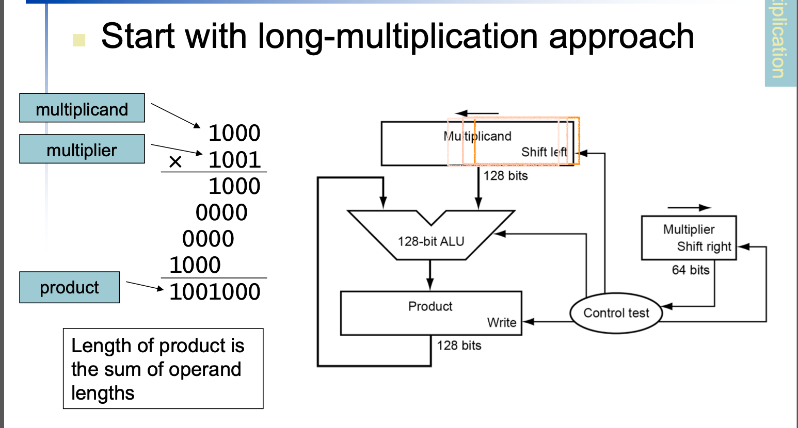

從左邊計算過程可以觀察出，乘數的每一位數去乘，結果只有兩種， 被乘數放下來，或者歸零，一位數向左 shift 一格。所以被乘數會先放在 右邊 64 bit，依序向左 shift 先存好。control test 根據乘數的位數 bit 來告訴 ALU 說這一次要不要加。Product 存最終結果。

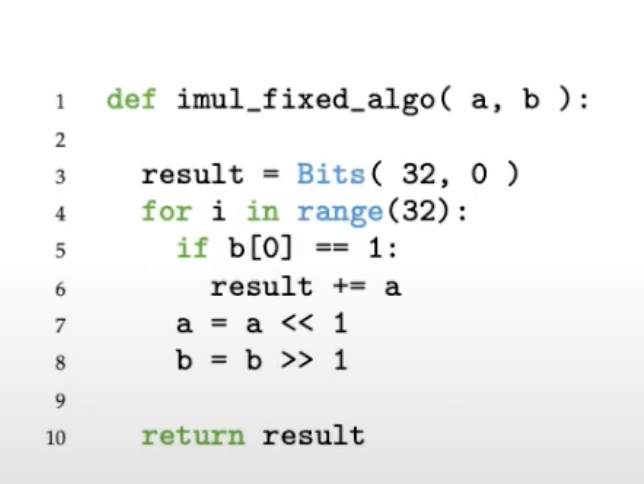

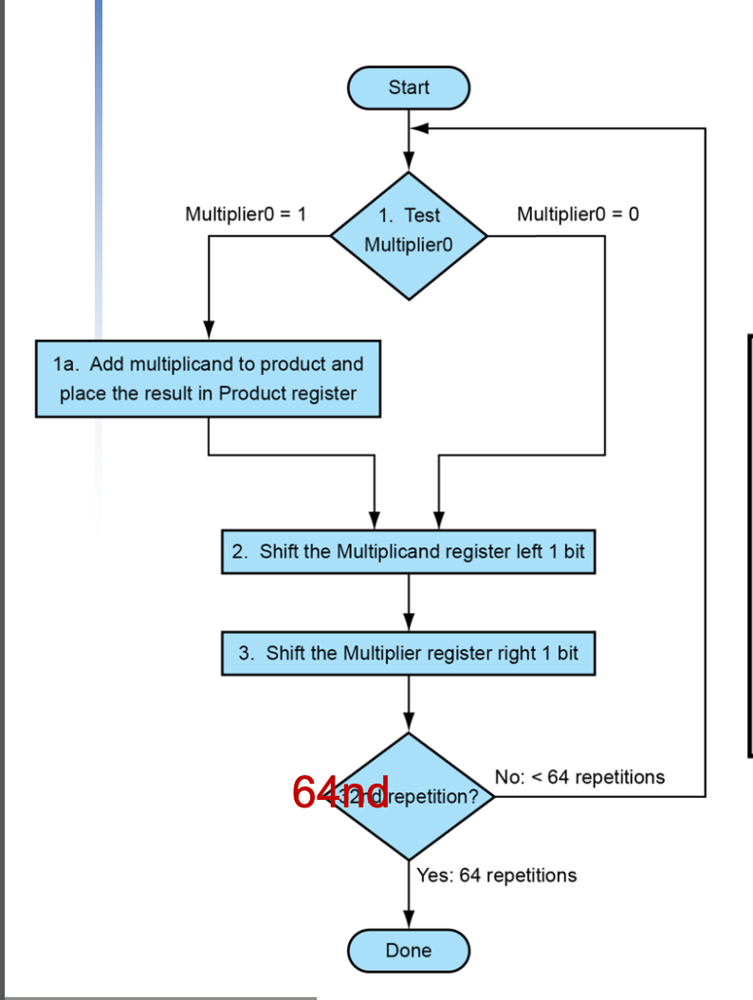

原始乘法器

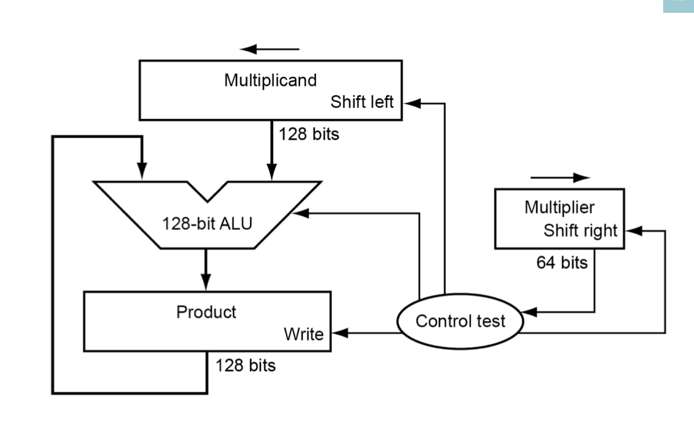

- 原本有兩個 shift

優化過的乘法器：

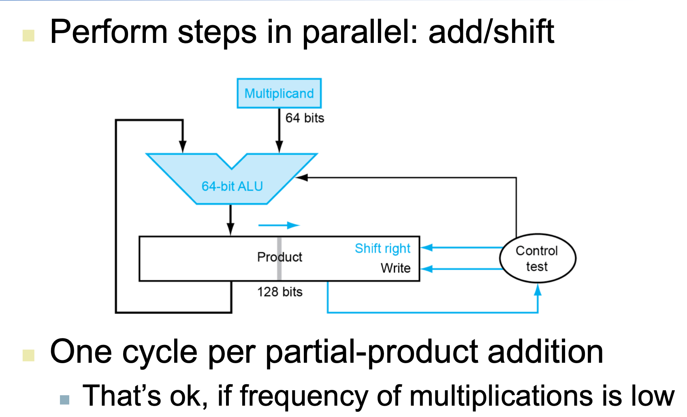

product 跟 multiplier 共用空間

product 從左向右放， multiplier 先放右邊，慢慢向右 shift

使用的空間變少： 40 %

ALU 在運算中只會用到 4 bit ，所以用 64 bit 就好

- 只用一個 shift
- 用 64 次的加法時間得到答案

更好的優化

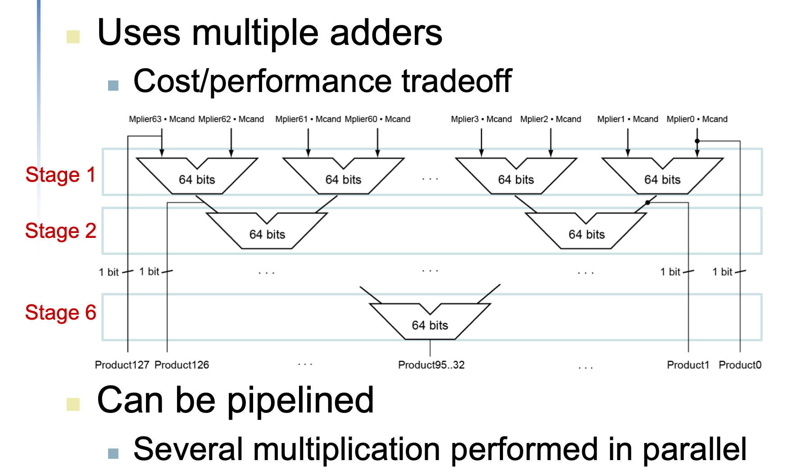

用多個加法器堆疊

- 用 6 次加法時間得到答案

但比較耗電。

會佔到晶片的面積

可以用 pipeline 加速：第一組數字算到 stage 2 時，第二組數字就進到 stage 1 開始做。生產線的概念。

### RISC-V 的四種乘法指令

 input 兩個 64 bit

`mul` :, 假如相乘結果超過 64 bit，只會 output 最低 64 bit 結果

`mulh`: 假如相乘結果超過 64 bit，只會 output 最高 64 bit 結果

要得到完整結果： 用 mul 跟 mulh 接起來。

`mulhu` :  mulh 的 unsigned 版本

`mulhsu` : 假設 input 一個是 signed 一個是 unsigned

（要 check overflow）

### 除法

先考慮 unsigned，算完之後再把符號加上去

remainder 一開始放被除數(divider)

商數的 bit 由能不能相減決定

共跑 64 次得到結果。

### 除法優化

ALU 不需要 128 bit → 用 64 bit

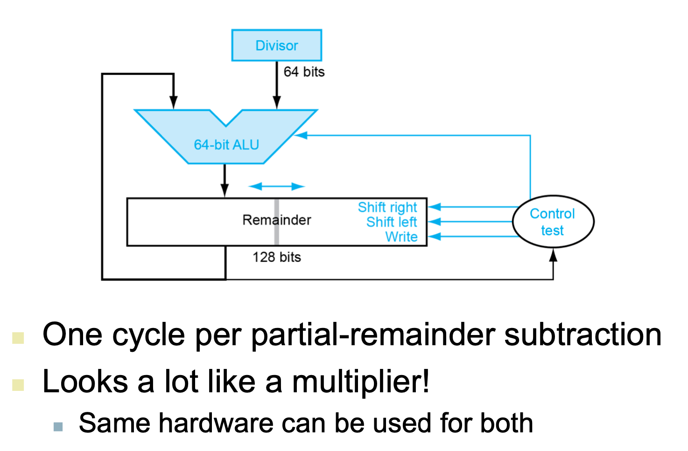

和乘法很像，所以可以跟乘法 share 硬體。（很少有程式同時做乘法跟除法）

或者直接用 shift 做（ 除以 2, 4, ...)

### RISC-V 的除法

`div` : 把商數放在暫存器裡面。

`rem` : output 餘數。
unsigned 的版本： `divu` , `remu`

假如出現除以 0，在 RISC-V裡面不處理，會 return 定義好的東西，不會發生 error，所以使用者要自己去檢查qq

## 浮點數 floating point

在 binary 裡：

小數點左邊一定是 1

Ex: 

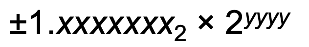

x 有 7 個， y 有 4 個，共需要 7 + 4 + 1 (sign) = 12 → 這是一個 12 bit 的 floating point

一般來說是用 32-bit 

需要比較精準的話： Double precision (64 bit)

### IEEE 標準格式

sign: 1 是負，0 是正

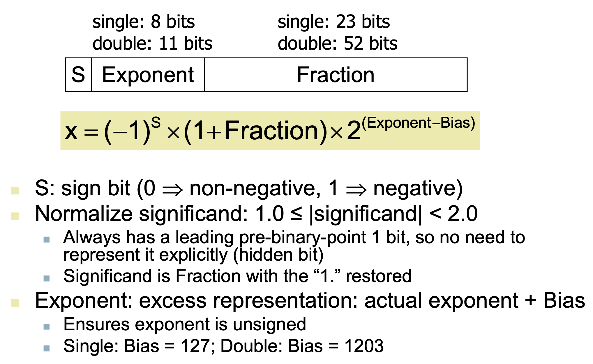

`Fraction`: 小數點後的數字

小數點後的數字要十進制轉二進制：

ex: 0.125

0.125 x 2^(n) = 1

知道 n = 3

故 fraction = 001 

`Exponent`: 

single 是 8 bits, 所以十進位是 0~255

`Bias`: single 是 127

所以 2 的指數部分範圍可以是 -127 ~ 128，但是 `Exponent` 的最大跟最小值保留起來做別的事：

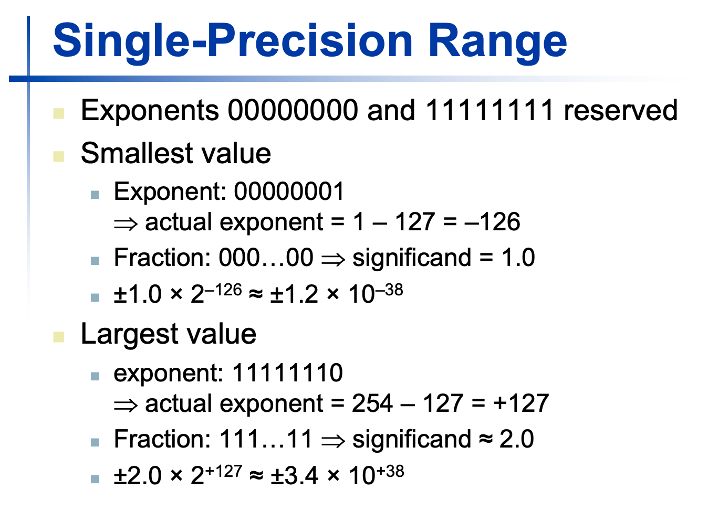

126 * 0.3010 = 38

總結： 32-bit 浮點數，可以表達的數字範圍： [-1.2x10e(-38), +3.4x10e38 ]

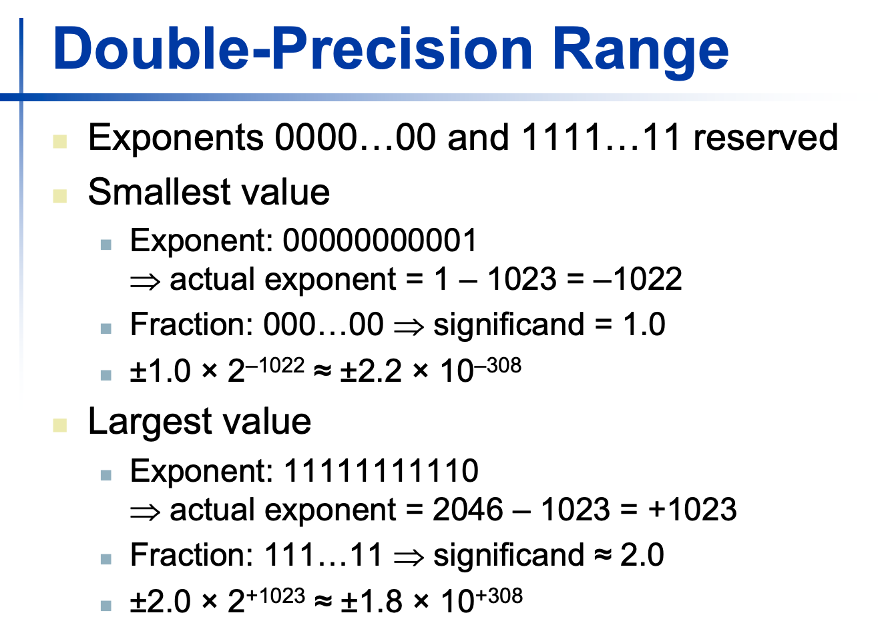

64-bit 則是 [-2.2 x 10e(-308), +1.8 x 10e(308)]

### 相對精準度

 用 fraction 來看，（小數點幾位）

single 有 23-bits → 十進位是小數點後 6 位

double 有 64-bits → 小數點後 16 

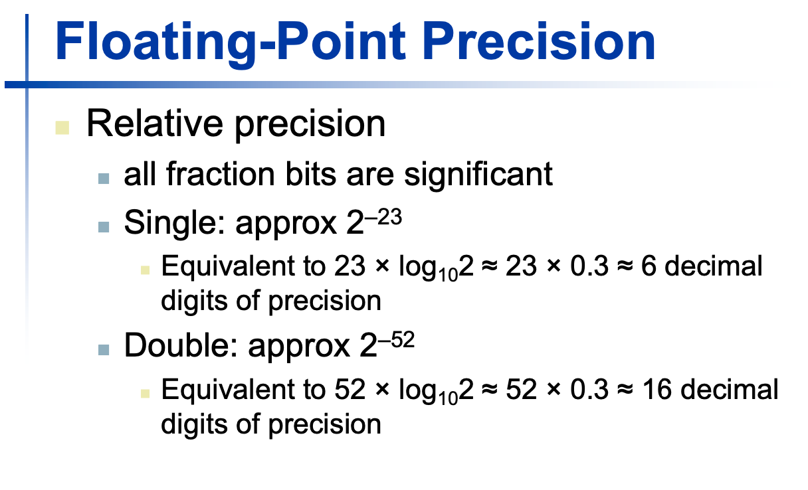

例子

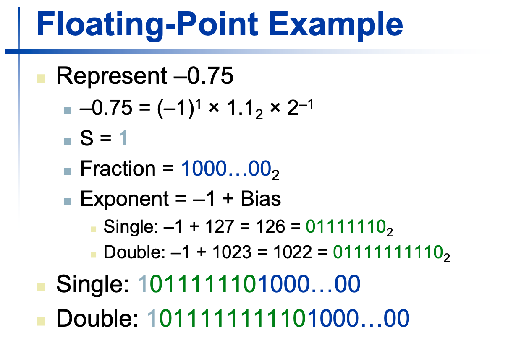

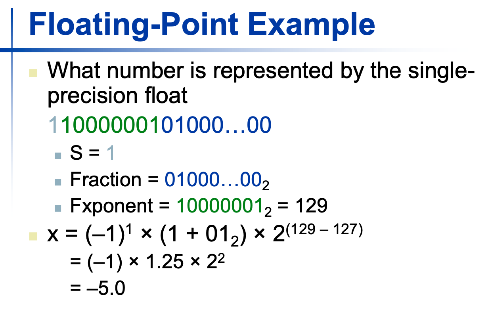

 

特例處理： 0 跟無限大

1. exponent 是 0 : 沒有 normalized 的最小數字

    可以作為`underflo`時的緩衝

    `underflow`: 數字太小

2. Exponent = 1111....1, Fraction=0000...0 → 無限大

    Exponent = 1111....1, Fraction != 0000...0 →  Not-a-number

    仍然可以拿來運算。

### 浮點數的加法

考慮 `4-digit` 的十進位加法

1. 先對齊位數
2. 相加
3. Normalize
4. 如果超過 4 個位數 → 四捨五入

二進位制也是一樣的操作。

### 實作浮點加法器的硬體

比整數還要花更多時間

## 浮點數的乘法

很類似 integer 

## 浮點數的矩陣相乘

 

# Reference

[https://sites.google.com/site/nutncsie10412/ge-ren-jian-jie/fu-dian-shu-biao-shi-fa](https://sites.google.com/site/nutncsie10412/ge-ren-jian-jie/fu-dian-shu-biao-shi-fa)