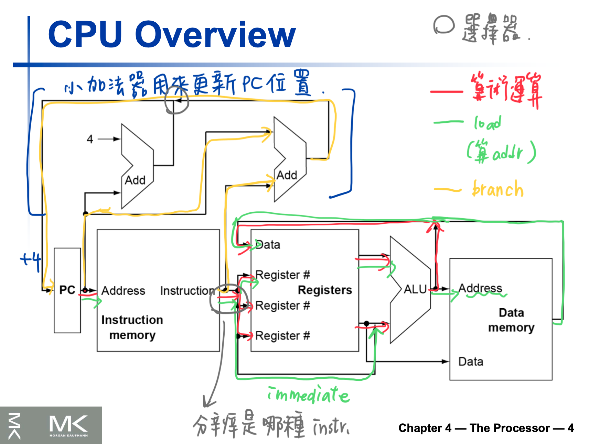
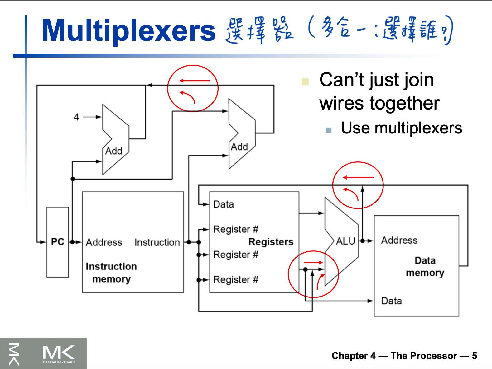
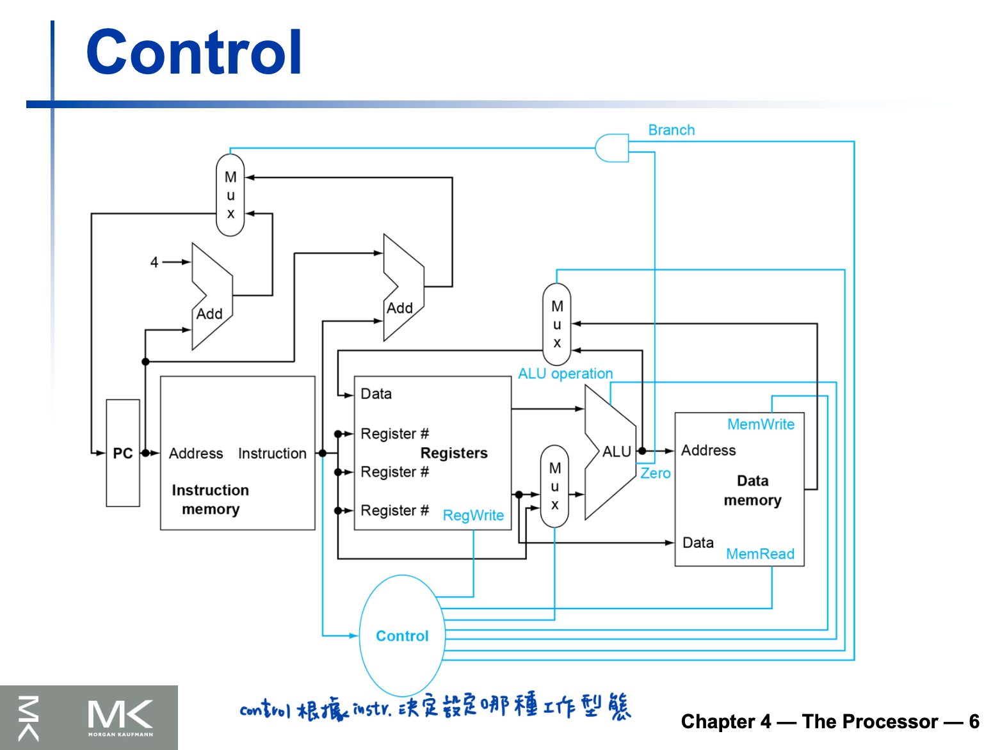

# Chap 4

之前我們學過要怎麼去用RISC-V instruction set ，現在則要實作幾個 instruction，例如 `ld`, `sd`, `add`, `sub`, `and`, `or`, `beq`。

雖然這幾個基本 instr. 沒有包含到全部的整數運算，也沒有任何浮點數運算，但是我們可以從中學怎麼 `創造一個datapath, 設計 control` 。其他的 instr. 都可以由此延伸。

不同的實作方式，就會影響到 clock rate 跟 CPI，進而影響電腦效能。

在 Chapter 1，有提過一些 key design principles ，都會在這章的實作看到。簡單複習：

1. 簡單有利於規律性（Simplicity favors regularity）;
2. 越小越快（Smaller is faster）;
3. 綜合考慮（Good design demands compromise）;
4. 常用的要速度快（Make the common case fast）。

在這一章學到的實作概念，也可以應用到其他的各種電腦，例如 server, embedded processor 等等。

這章包含的內容：

4.2, 4.7-7.9: 如何建一個 processor.

4.3, 4.4, 4.6: processor 的 performance.

4.5: 介紹 `pipelining` 的概念

4.10: 目前的趨勢

4.11: 介紹 intel Core i7, ARM Cortex-A53

4.12: 如何用 instruction-level 的平行處理把矩陣相乘的 performance 提升到兩倍甚至更多。

## Overview

